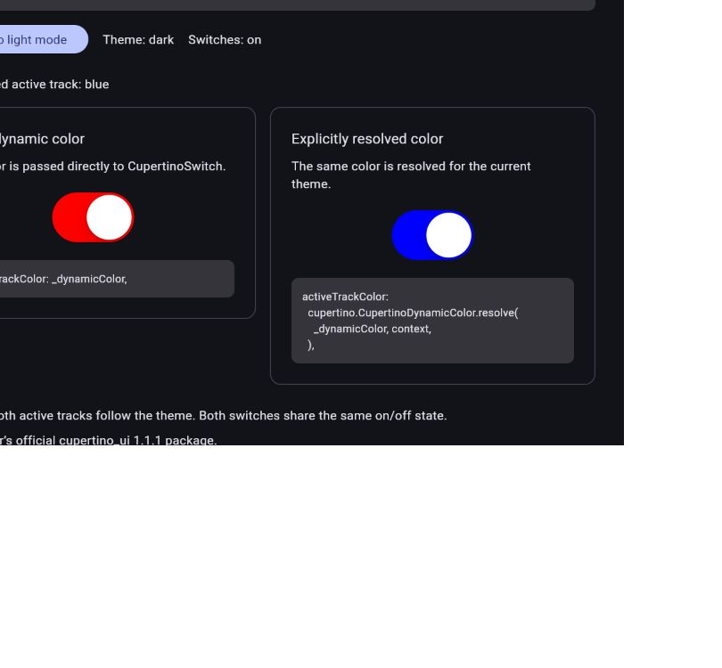
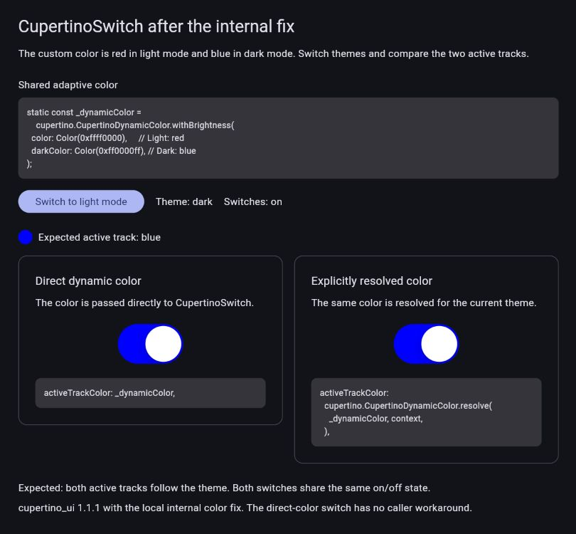

# CupertinoSwitch adaptive colors: before and after

This standalone demo passes the same custom `CupertinoDynamicColor` directly
to a switch before and after a local patch to `cupertino_ui` 1.1.1. The color
is red in light mode and blue in dark mode. Keep both switches on, then toggle
the theme.

| Package | Direct color, dark mode | Explicitly resolved control |
| --- | --- | --- |
| Original 1.1.1 | Incorrectly red | Blue |
| Locally patched 1.1.1 | Blue | Blue |

Before the fix:



After the internal fix:



The app code is identical in both runs. `PACKAGE_FIXED` changes the page's
label only. The behavior changes because the library resolves its final
track and thumb colors against the current context before painting.

The right-hand switch is a control using the existing caller workaround.
After the patch, the left-hand switch works with the adaptive color passed
directly, without that workaround.

## Files

- `lib/main.dart`: demo UI, adaptive-color definition and visible code snippets.
- `patches/cupertino_ui-dynamic-colors.patch`: six color-resolution changes
  to the official package's `lib/src/switch.dart`.
- `test/demo_test.dart`: painted colors across light/dark/light transitions
  and normal switch interactions.
- `test/dynamic_colors_test.dart`: regression tests for custom track and thumb
  colors and positive controls.
- `tool/prepare.ps1`: selects the original package or creates an ignored local
  copy with the patch applied. It does not change the shared package cache.

The official Cupertino implementation lives in
[`flutter/packages`](https://github.com/flutter/packages/tree/main/packages/cupertino_ui).
This branch of the Flutter fork hosts the demo and proposed package patch;
it does not change Flutter SDK source. An upstream library PR belongs in
`flutter/packages`.

## Run

Use a Flutter SDK compatible with this checkout (tested with Flutter
3.49.0-0.2.pre and Dart 3.14.0-294.0.dev), PowerShell, and Git. Run these
commands from this directory. `-Flutter` can be an absolute path to
`flutter.bat` if Flutter is not on PATH. Initial dependency setup needs
network access. In that case, use the same absolute executable for the
`flutter run` and `flutter test` commands below.

Original package:

```powershell
./tool/prepare.ps1 -Mode Original
flutter run -d web-server --web-hostname 127.0.0.1 --web-port 8766 --no-pub
```

Stop that run before changing the package used by this app directory.
Then try the actual internal fix:

```powershell
./tool/prepare.ps1 -Mode Fixed
flutter run -d web-server --web-hostname 127.0.0.1 --web-port 8766 --no-pub --dart-define=PACKAGE_FIXED=true
```

The web-server device prints a URL to open in a browser. The page starts in
light mode; click **Switch to dark mode**. With the fixed package, both
active tracks turn blue. Toggle back to light mode to see both turn red.

## Verify

Correct-behavior regression tests are expected to fail against the original
package and pass after the patch:

```powershell
./tool/prepare.ps1 -Mode Original
flutter test test/dynamic_colors_test.dart --no-pub --reporter expanded

./tool/prepare.ps1 -Mode Fixed
flutter test test --no-pub --reporter expanded --dart-define=PACKAGE_FIXED=true --dart-define=EXPECT_DYNAMIC_COLOR_RESOLVED=true
```

Generated dependencies, the patched package copy, and build output are ignored.
There is no issue or pull request published as part of this demo branch.

Verified on October 5, 2026: original package regression suite 4 passed,
6 failed; patched package all 12 tests passed; app/test analysis reported no
issues. The actual light/dark comparison was also verified in the browser.
